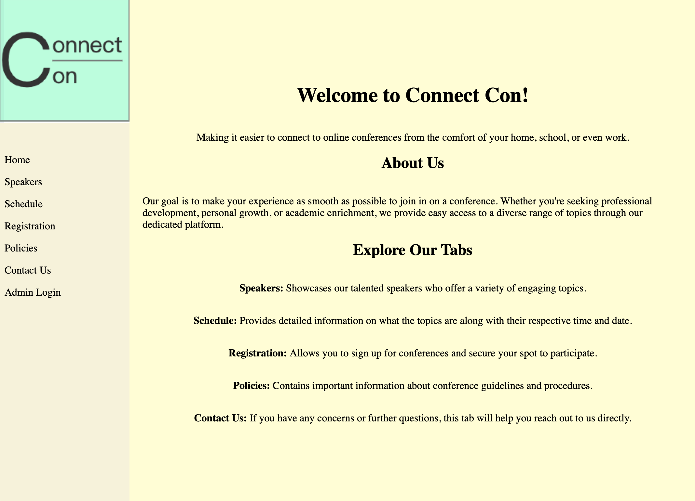
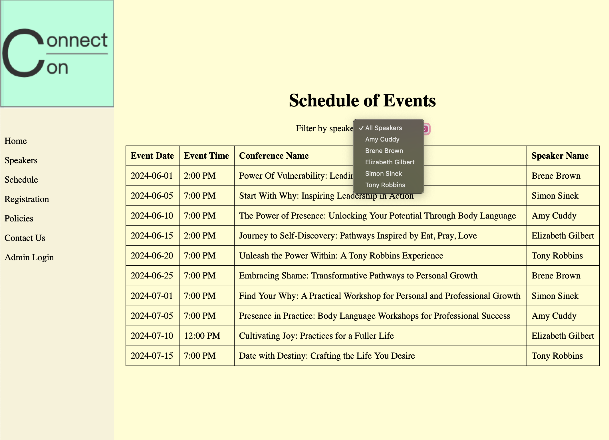
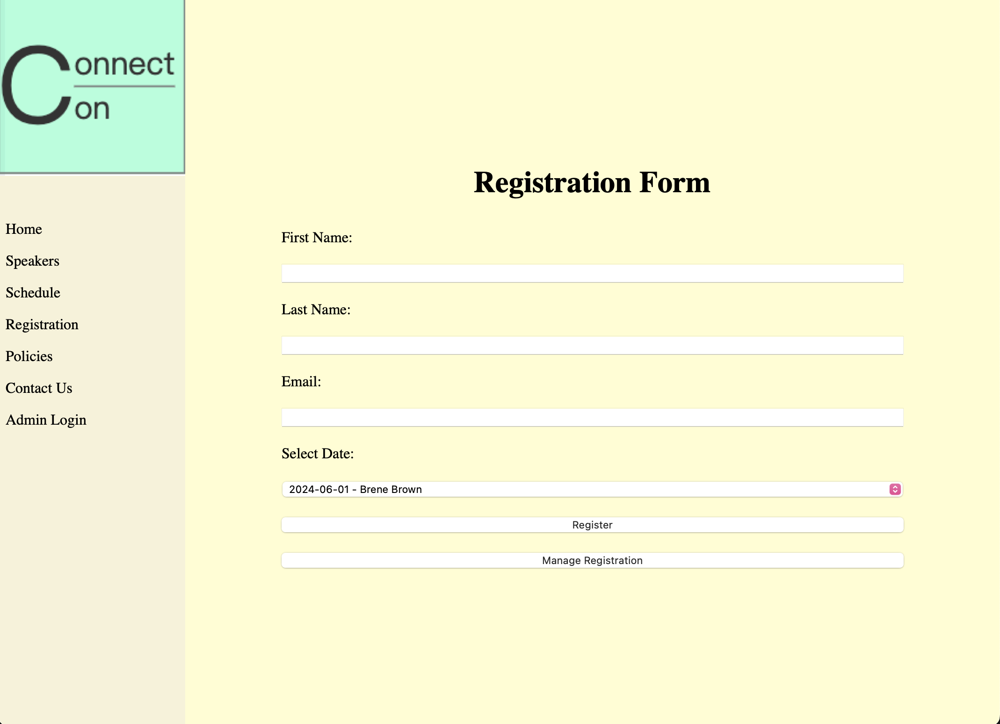
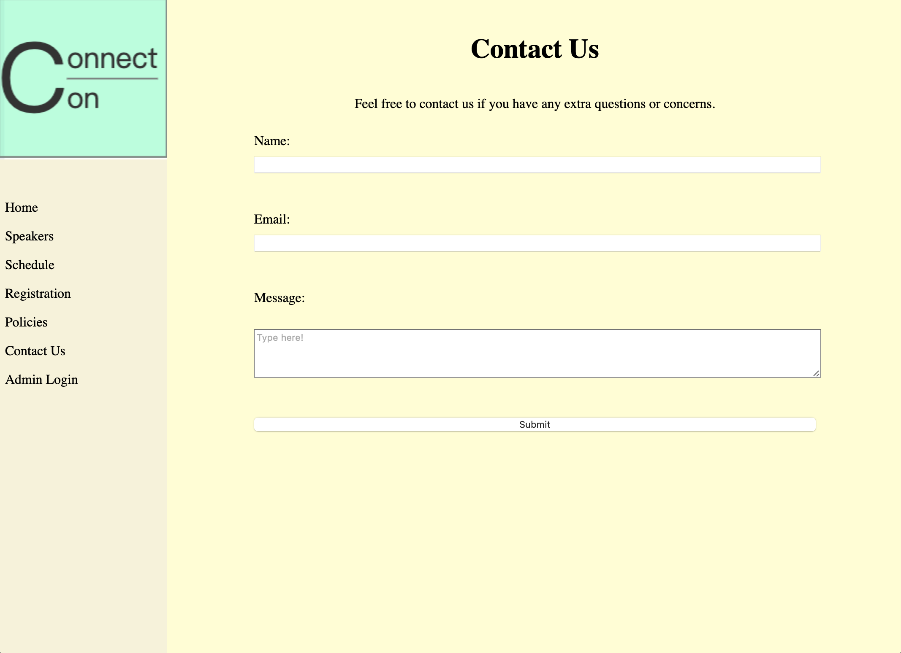
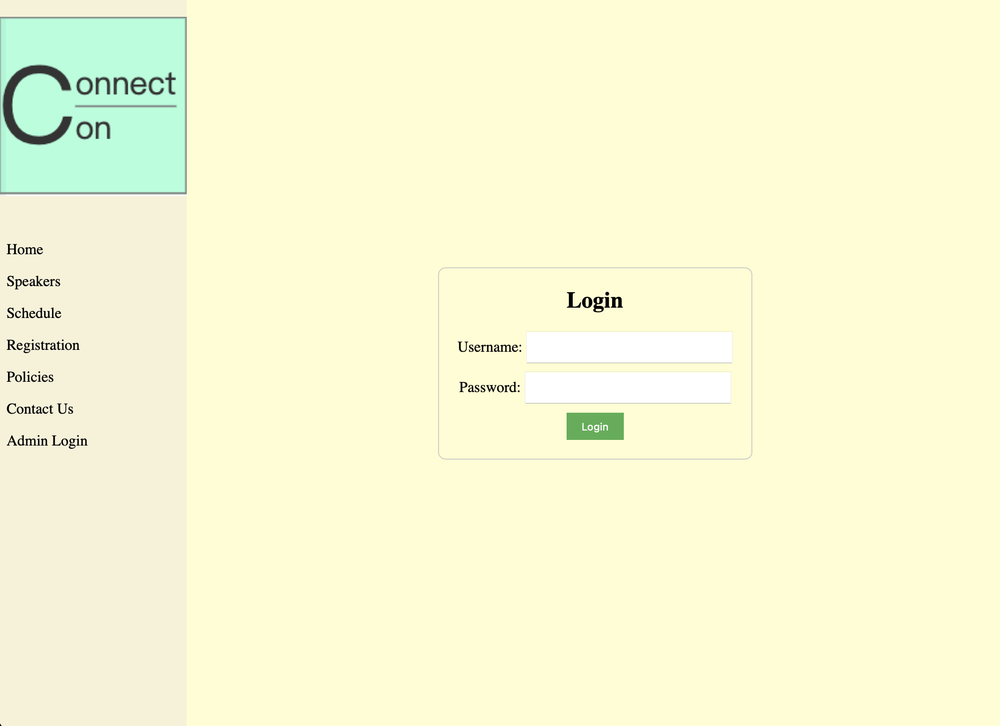

# Conference Booking Website

This is an online conference booking website that allows users to view different speakers, reserve slots for conferences, and manage their registrations. The website also features an admin portal for managing schedules and registrations.

## Features

- **View Speakers:** Users can browse a list of available speakers and filter them based on their preferences.
- **Reservation System:** Users can reserve a slot for a conference and receive a generated confirmation number.
- **Schedule Tab:** Allows users to filter speakers by name, helping them find their favorite speakers quickly.
- **Registration Management:** Users can cancel their reservations using the confirmation number they receive upon registration.
- **Admin Portal:** Admin users have access to an overview of all the speakers' schedules and can view all registered users. This portal provides a comprehensive tool for managing the conference efficiently.
- **Admin Login:** The admin portal is protected by a login system. The default username and password are:
  - **Username:** `admin`
  - **Password:** `admin`
- **Dynamic Confirmation:** Each successful registration generates a unique confirmation number for booking and cancellation management.

## Technologies Used

- **Frontend:** HTML, CSS, JavaScript
- **Backend:** PHP
- **Database:** MySQL (MariaDB) using XAMPP
- **Environment:** XAMPP for local development and testing

## Setup

1. Download and install [XAMPP](https://www.apachefriends.org/index.html) for local development.
2. Copy the project folder (`conference_booking`) to the `htdocs` directory in your XAMPP installation.
   - The full path should be: `/Applications/XAMPP/htdocs/conference_booking`.
3. Start XAMPP and activate the Apache and MySQL modules.
4. Import the provided SQL file into phpMyAdmin to set up the database:
   - Open `http://localhost/phpmyadmin/` in your web browser.
   - Create a new database (e.g., `conference_db`) and import the SQL file.
5. Configure the database connection settings in the project's PHP files (if necessary) to match your local setup.
6. Access the website by navigating to `http://localhost/conference_booking` in your browser.

## Usage

- **Users:** Browse through the list of speakers, filter them by name, and reserve slots for conferences.
- **Admin Portal:** Log in using the credentials provided to access an overview of all speaker schedules and user registrations, allowing for efficient conference management.

## Screenshots

Here is a quick glimpse of some of the key features of the conference booking website:

### Home Tab

### Schedule Tab

### Registration Tab

### Contact Tab

### Admin Tab

These screenshots provide a brief glimpse into the website. For full functionality, explore the project by running it locally.

## License
This project is open-source and available under the [MIT License](LICENSE).
